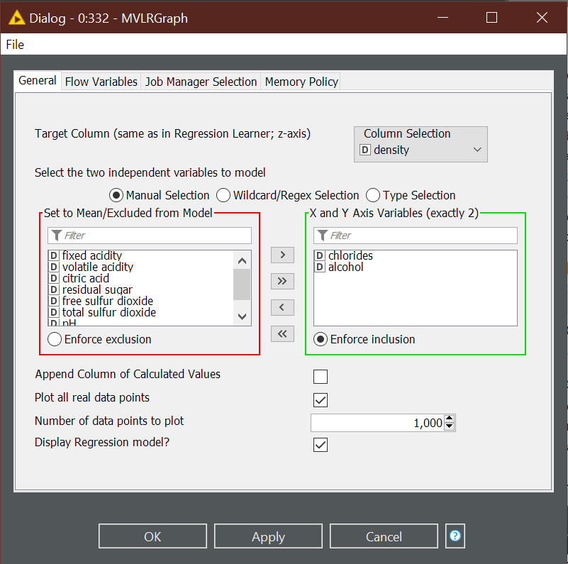
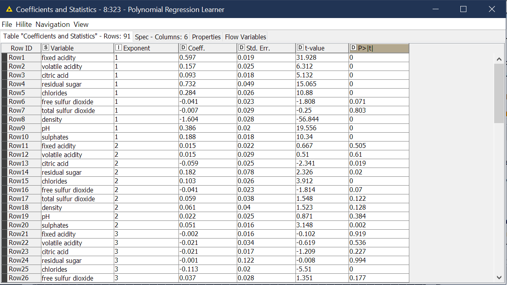

# Multivariate Linear/Polynomial Regression 3D Model
This node provides a 3D representation to obtain a visual "closeness of fit" test when provided a co-efficients table output by an upstream multivariate regression node.

The node is intended as a visual aid to check model fit or prevent overfitting. It also serves as a good presentation tool and generally improves basic understanding of relationships between columns/variables in a data set. This node can visualize linear and polynomial regression models between 2 and 9 degrees. Note while it is only possible to represent three dimensions in 3D space (x,y,z); this node can make assumptions about other variables to help visualize a model. Currently, this node uses real data values for each point plotted on the 3D plane and, in the model plane, uses the arithmetic mean for variables that are not represented on the x, y, or z plane. 

## General Options

### Target Column
Select the target column used in the Regression Learner Node (z-axis)
### Select the two independent variables to model(Column Selection)
In the column selection windows, manipulate the names of the data columns until you have exactly two remaining in the right hand container. These will be used as the independent variables when modeling the learned regression equation. The two columns will be represented visually as the "x" and "y" axis variables on the 3D graph. 

_IMPORTANT:_ These columns must have been used as variables in the previous regression node. If you select a column that is in the data column, but is NOT in the coefficients table, then the node will intentially fail when executing. If the node fails, check your selected columns in the right hand side to make sure they match the columns used in your regression node.

### Append Column
This option allows you to append a column containing the calculated value of a row, using the regression equation from the previous node.

### Plot All Real Data Points
Select this option if you want a point on the graph for each row in the data table. If this option is selected, you cannot define a specific number of points to display in the "Number of data points to plot" option.

### Number of data points to plot
If you do not want all data points to be represented in the graph, you may define a specific number of points to display. These points will be chosen sequentially from the top of the data table moving down.

### Display Regression Model 
This option allows you to toggle the display of the modeled 3D plane representation of the previous node, essentially leaving a 3D scatter plot of the data points.

## Future Options (under consideration)

### General Options

#### Show Data Points
Toggle display of real data points. When off, regression model will be rendered in 3D space alone.

### View Options

#### Adjust Data Point Size
Input value 1-25 in pixels for data point size. Default setting (current) is 10.

#### Adjust Data Point Color Seed
Current point scheme is calculated with the percent error of each point to its modeled value mulitplied by the Red and Green (RGBA) values. Allows user to choose an alternate seed to adjust color.
    
## Ports

### In-Ports

#### 1) Regression Co-efficients Table
Takes in the output coefficient table produced by a regression node (linear/polynomial).
#### 2) Source Data Table
Takes in the data corresponding to the regression function produced in the regression node. Columns must match the output coeffiecients columns. Can either take the training data table (which was porocessed by the regression node) or the test data (to visualize model fit).

### Out-Ports
#### 1) Data Table (Optional Appended Column)
Outputs the input data table (not the coefficient table) with an optional column of target values calculated with the regression equation provided. This option can be toggled in the configuration dialog.

## Views
### 3D Regression Plot
3-Dimensional Representation of real data points mapped over a planar model of a learned regression equation.

